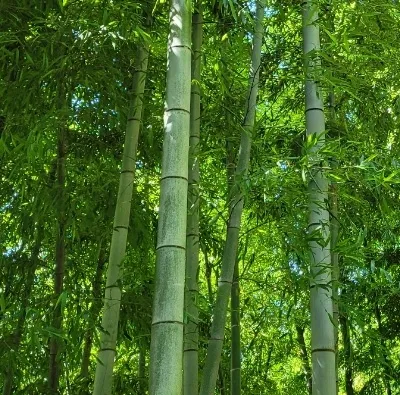

# SayYOUNG | 늘푸르게 성장하는 개발자
  - 이름 : 이세영 (李世榮)
  - 영문명 : LEE SEYOUNG
  - Email : gch05612@gmail.com
  - Phone : 010-5466-4247
# Introduce.
**싸피 12기** 교육생으로 이번 교육을 통해 무한한 발전을 이루고 싶습니다. 관심 분야는 **AIOT**분야 이며 머든 만드는 것을 좋아해서 웹 개발도 좋아합니다. 아직은 ~~모르는 것도 많아서~~ 무엇을 하겠다 라고 말씀드리기 어렵지만 부지런히 배워서 **꼭 목표를 찾겠습니다**.

# Experience
  1. Samsong Soft Ware Academy 12기 이수
      - 부지런히 배워서 채우겠습니다!
  2. 육군 장교 출신 (37사단 정보통신대대)
      - 유선소대장(6개월), 정작과장(6개월), 지원과장(1년) 복무
      - 케이블 작업, 문서 작업에 능숙하고 발표에 능합니다.
  3. 아이디어 공모전 입상 / 특허
      - 한국 CDE학회 장려상, 건조대를 겸한 캐리어, 어디서든 설치 가능한 완강기[특허, 현재 소멸]

# Certificate
  - 산업안전기사
  - 초경량 비행장치 조종사
  - 네트워크 관리사 2급
  - 컴퓨터활용능력 2급

# Education
  - 2017.03~2021.02 동의대학교 로봇자동화공학